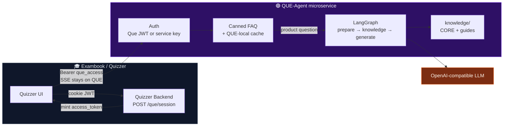

  


-0ea5e9?style=for-the-badge)

  


**QUE** is the in-workspace AI assistant for **Exambook (Quizzer)** — a separately deployable microservice that helps teachers with product how-tos, click paths, and workflows without touching Quizzer’s database or overloading the main API with chat traffic.

  


```
╔══════════════════════════════════════════════════════════════════════════╗
║     Quizzer UI  →  mint Que token  →  QUE chat/SSE  →  grounded answer   ║
║        + LangGraph agent  +  product knowledge  +  canned FAQ cache       ║
╚══════════════════════════════════════════════════════════════════════════╝
```


---

## 🎯 Why QUE Exists

Quizzer is a full assessment platform — create, publish, proctor, grade, analyze. Teachers still get stuck on **where things live** and **what to click next**. **QUE** is Quizzer’s dedicated assistant microservice: grounded product guidance, streamed in-app, without putting every chat token through the Quizzer backend.

Quizzer already owns exams, attempts, grading, Arena, and integrations. QUE is the **assistant slice** of that product:

- **Not** a second LMS
- **Not** a shared DB worker on Quizzer’s Postgres
- **Yes** — a first-class Quizzer microservice with its own deploy, auth boundary, and knowledge brain

```
Quizzer monorepo (product)          QUE-Agent repo (microservice)
──────────────────────────          ────────────────────────────
Frontend + Backend + workers   ←→   FastAPI + LangGraph + knowledge/
Cookie JWT / attempt tokens         Que access JWT + service key
Postgres · Redis · Celery           No Quizzer DB · QUE-local cache
```

---

## ✨ Capabilities at a Glance

| LangGraph | Knowledge | Streaming | Fast Paths |
|---|---|---|---|
| prepare | CORE.md always | SSE token stream | Canned FAQs |
| knowledge | Keyword guides | Non-stream chat | Typo-tolerant |
| generate | SAY / NEVER | Meta → token* | Multi-variant |
| Stateless turn | Click paths | done / error | No LLM cost |

| Auth | Cache | Hardening | Deliver |
|---|---|---|---|
| Que JWT (browser) | Intent TTL/LRU | Secret guards | Docker non-root |
| Service key | LLM reply cache | History sanitize | gunicorn + uvicorn |
| No key in FE | Variant rotate | Public err codes | CI audit + tests |

---

## 📋 Table of Contents

- [Why QUE Exists](#-why-que-exists)
- [Capabilities at a Glance](#-capabilities-at-a-glance)
- [Place in the Quizzer Platform](#-place-in-the-quizzer-platform)
- [System Architecture](#️-system-architecture)
- [Core Features Deep Dive](#-core-features-deep-dive)
- [Tech Stack](#️-tech-stack)
- [HTTP API](#-http-api)
- [Local Quick Start](#-local-quick-start)
- [Quizzer Integration](#-quizzer-integration)
- [Knowledge Base](#-knowledge-base)
- [Configuration](#-configuration)
- [Repository Structure](#-repository-structure)
- [Development & CI](#-development--ci)
- [Production Deploy](#-production-deploy)
- [Security Posture](#️-security-posture)
- [Roadmap](#-future-roadmap)
- [Ownership & License](#-ownership--license)

---

## 🧩 Place in the Quizzer Platform

QUE is a **sub-service of Exambook (Quizzer)**, not a standalone product brand.


| Concern             | Owned by Quizzer         | Owned by QUE                    |
| ------------------- | ------------------------ | ------------------------------- |
| Login / sessions    | Cookie JWT, AuthSession  | —                               |
| Prove user may chat | `POST /que/session` mint | Verify `que_access` JWT         |
| Chat + SSE tokens   | — (not proxied)          | `/v1/chat`, `/v1/chat/stream`   |
| Exam / student data | Postgres                 | **No DB access**                |
| Product how-tos     | UI + docs                | `knowledge/` packs              |
| Rate limits on mint | Quizzer policies         | —                               |
| LLM for assistant   | —                        | OpenAI-compatible via LangChain |


| Quizzer (product) | QUE (microservice) |
|---|---|
| Creator workspace · Exam runtime | In-app assistant · product brain |
| AI generation · Proctoring · Grading | Independent scale & deploy |
| Analytics · Arena · Integrations | No Quizzer package imports |
| Postgres · Redis · Celery | No Quizzer DB · QUE-local cache |

---

## 🏗️ System Architecture




```
Teacher in Quizzer
        │
        ▼
┌──────────────────────┐
│ Quizzer Backend      │  Authenticate (cookie) · mint short Que JWT
│ POST /que/session    │  Light hop — not a chat proxy
└──────────┬───────────┘
           │ access_token + que_base_url
           ▼
┌──────────────────────┐
│ QUE-Agent :8100      │  Auth → canned? → cache? → LangGraph → LLM
│ /v1/chat/stream      │  SSE tokens never traverse Quizzer
└──────────────────────┘
```

Deep file map: **[ARCHITECTURE.md](ARCHITECTURE.md)** · Auth A→Z: **[AUTH.md](AUTH.md)** · Build roadmap: **[docs/que-agent-handbook.html](docs/que-agent-handbook.html)** · Progress: **[docs/BUILD_PROGRESS.md](docs/BUILD_PROGRESS.md)** · Agent rules: **[AGENTS.md](AGENTS.md)**

---

## 🚀 Core Features Deep Dive

### 🤖 LangGraph Conversational Agent

```
START ──► prepare ──► knowledge ──► generate ──► END
            │            │             │
            │            │             └─ ChatOpenAI (streaming capable)
            │            └─ CORE.md + ≤2 keyword guides
            └─ identity + sanitize history (no client system prompts)
```

- **Stateless turns** — client sends history each request (no Quizzer DB chat store on QUE)
- **Bounded history** — message + character caps protect latency and cost
- **Identity owned by QUE** — callers cannot override persona via a leading `system` message

### 📚 Answer-Oriented Product Knowledge

Not thin FAQ stubs. Guides are written for real teacher questions:

```
Use when → click path → what the UI shows → decision tree → SAY / NEVER
```


| Pack                      | Role                                                        |
| ------------------------- | ----------------------------------------------------------- |
| `knowledge/CORE.md`       | Always injected product map                                 |
| `knowledge/guides/*`      | Navigation, publish/share, monitoring, empty data, Arena, … |
| `knowledge/manifest.json` | Keywords + `max_guides`                                     |


Authoring rules: `[knowledge/README.md](knowledge/README.md)`

### ⚡ Canned FAQ Fast Path

Common chit-chat never burns an LLM call:


| Intent examples               | Behavior                       |
| ----------------------------- | ------------------------------ |
| hello / hi / Heelllo          | Warm Quizzer invite (variants) |
| what can you do / who are you | Capabilities blurb             |
| what is Quizzer               | Product one-liner set          |
| thanks / bye                  | Short closers                  |


Fuzzy match: casing, punctuation, elongated letters, small typos.  
Variant rotation avoids repeating the same line back-to-back in a conversation.

### 🧠 QUE-Local Cache (not Quizzer Redis)

```
Intent cache     → reuse FAQ classification
Variant cache    → don’t repeat the same canned line
LLM reply cache  → identical sanitized history fingerprints
```

Process-local TTL/LRU under `QUE_CACHE_*` env vars. Separate from Quizzer’s Redis entirely.

### 🔐 Dual Auth Boundary


| Credential       | Used by                      | Header                    |
| ---------------- | ---------------------------- | ------------------------- |
| `que_access` JWT | Browser after Quizzer mint   | `Authorization: Bearer …` |
| Service key      | Servers / ops / future tools | `X-Que-Service-Key`       |


**Never** ship `QUE_SERVICE_KEY` to the frontend.

---

## 🛠️ Tech Stack


| Layer          | Choice                                                   |
| -------------- | -------------------------------------------------------- |
| Language       | Python **3.11**                                          |
| Package / lock | [uv](https://docs.astral.sh/uv/) + `uv.lock`             |
| API            | FastAPI · Uvicorn · Gunicorn                             |
| Agent          | LangGraph · LangChain · OpenAI-compatible chat models    |
| Auth           | PyJWT (`que_access`) · HMAC service key                  |
| Logging        | structlog                                                |
| Ship           | Multi-stage Dockerfile · non-root user · `/health` probe |


Aligned with Quizzer pins where practical (FastAPI / LangChain / LangGraph family).

---

## 📡 HTTP API


| Method | Path              | Auth              | Notes                          |
| ------ | ----------------- | ----------------- | ------------------------------ |
| `GET`  | `/health`         | none              | Liveness / LB probe            |
| `GET`  | `/v1/identity`    | Bearer **or** key | Persona metadata               |
| `POST` | `/v1/chat`        | Bearer **or** key | Full assistant message         |
| `POST` | `/v1/chat/stream` | Bearer **or** key | SSE `meta` → `token`* → `done` |


```bash
curl -N http://127.0.0.1:8100/v1/chat/stream \
  -H "Authorization: Bearer $QUE_ACCESS_TOKEN" \
  -H "Content-Type: application/json" \
  -d '{"messages":[{"role":"user","content":"Where is Monitoring?"}]}'
```

---

## ⚡ Local Quick Start

**Needs:** Python 3.11 · uv 0.8.x · LLM API key

```bash
cp .env.example .env
# Set LLM_API_KEY, QUE_JWT_SECRET (same as Quizzer), CORS_ALLOW_ORIGINS

uv sync
uv run python -m app.run
```

Default: `**http://127.0.0.1:8100**`

```bash
curl -s http://127.0.0.1:8100/health
```

`/docs` is enabled only when `APP_ENV` is local/dev.

---

## 🔗 Quizzer Integration

Recommended production path — **mint on Quizzer, chat on QUE**:

```
1. Quizzer UI  →  POST /que/session     (cookie JWT)
2. Quizzer UI  →  QUE /v1/chat/stream   (Bearer que_access)
```


| Quizzer env      | QUE env                                           |
| ---------------- | ------------------------------------------------- |
| `QUE_JWT_SECRET` | `QUE_JWT_SECRET` (identical, ≥32 chars)           |
| `QUE_BASE_URL`   | Public origin of this service                     |
| —                | `CORS_ALLOW_ORIGINS` = Quizzer frontend origin(s) |


| Do | Don't |
|---|---|
| Mint short-lived Que JWT on Quizzer | Put `QUE_SERVICE_KEY` in the frontend |
| Stream SSE directly to QUE | Proxy every chat token through Quizzer Backend |
| Keep the service key server-only | Share Quizzer Redis/DB with QUE |

> Some Quizzer WIP branches still expose a BFF `/que/chat` proxy. Prefer token exchange so Quizzer is not on the streaming hot path.

---

## 📖 Knowledge Base

```
knowledge/
  CORE.md                 # always on
  manifest.json           # retrieval config
  guides/
    navigation.md
    publish-share.md
    live-monitoring.md
    empty-data.md
    lifecycle.md
    verification.md
    arena.md
```

Live counts (“how many students attempted?”) still need future authorized Quizzer tools — packs must not invent them.

---

## ⚙️ Configuration

See `[.env.example](.env.example)`.


| Variable                                     | Role                                                       |
| -------------------------------------------- | ---------------------------------------------------------- |
| `APP_ENV`                                    | `local` / `production` (prod fails closed on weak secrets) |
| `CORS_ALLOW_ORIGINS`                         | Frontend origins allowed to call QUE                       |
| `QUE_JWT_SECRET`                             | Shared with Quizzer — verifies browser tokens              |
| `QUE_SERVICE_KEY`                            | Server/ops only                                            |
| `LLM_API_KEY` / `LLM_BASE_URL` / `LLM_MODEL` | OpenAI-compatible model                                    |
| `QUE_CACHE_ENABLED`                          | QUE-local cache switch                                     |
| `QUE_CACHE_*_TTL_SECONDS`                    | Intent / LLM / variant TTLs                                |
| `ALLOW_INSECURE_LOCAL_NO_AUTH`               | Local escape hatch — **blocked** outside local             |


---

## 📁 Repository Structure

```
Que-Agent/
├── app/
│   ├── api/              # FastAPI routers (health, chat)
│   ├── core/             # config, auth, tokens, LLM, QUE cache, errors
│   ├── graphs/           # LangGraph prepare → knowledge → generate
│   ├── identity/         # thin persona (not product docs)
│   ├── knowledge/        # pack selection code
│   ├── orchestration/    # pipeline, history, canned FAQs
│   ├── schemas/          # Pydantic contracts
│   └── services/         # SSE framing
├── knowledge/            # markdown product brain (data)
├── tests/
├── scripts/start.sh      # gunicorn + uvicorn workers
├── Dockerfile
├── docs/
│   └── que-agent-handbook.html  # phased build roadmap (open in browser)
├── ARCHITECTURE.md
├── AUTH.md
├── AGENTS.md
└── README.md             # you are here
```

---

## 🧪 Development & CI

```bash
uv sync
uv run ruff check app tests
uv run python -m pytest tests/ -v
```

CI pipeline:

1. gitleaks secret scan
2. `uv sync --frozen`
3. ruff
4. pip-audit (High+) + CycloneDX SBOM
5. pytest

Deploy/CI should prefer `**uv sync --frozen**`.

---

## 🚢 Production Deploy

`knowledge/` **must** be in the image (the Dockerfile copies it). A deploy without packs
will boot, but QUE cannot ground answers in product guides.

```bash
docker build -t que-agent:latest .
docker run --rm -p 8100:8100 --env-file .env que-agent:latest
```

**Regular knowledge updates:** edit markdown under `knowledge/` → commit → rebuild/redeploy.
No separate knowledge service is required for v0.1.


| Check      | Requirement                                 |
| ---------- | ------------------------------------------- |
| Knowledge  | `knowledge/manifest.json` + packs in image  |
| Env        | `APP_ENV=production`                        |
| Secrets    | Strong `QUE_JWT_SECRET` + `QUE_SERVICE_KEY` |
| CORS       | Exact frontend origins only                 |
| Auth hatch | `ALLOW_INSECURE_LOCAL_NO_AUTH=false`        |
| Edge       | TLS on `que.<your-domain>`                  |
| Probes     | `/health` on the load balancer              |


Multi-worker note: in-process cache is per worker by design for v0.1. Shared QUE-owned cache can land later — still never Quizzer Redis.

---

## 🛡️ Security Posture

- Dual auth (JWT audience/issuer checks · constant-time service key)
- Client `system` prompts stripped
- Bounded history + stable public error codes (no provider leakage)
- Production refuses weak/placeholder secrets
- CI: gitleaks + dependency audit
- Docker runs as non-root `que`

---

## 🗺️ Future Roadmap

```
Now                         Next                        Later
─────────────────────       ─────────────────────       ─────────────────────
LangGraph chat              Authorized Quizzer tools    Shared QUE cache
Knowledge packs             (read-only account data)    Stronger retrieval
Canned FAQ + local cache    Embeddings when needed      Checkpointer / history
Token-exchange auth         Write tools (gated)         Multi-region QUE
```

**Non-goals today:** Quizzer DB access · importing Quizzer packages · inventing live metrics in markdown.

---

## 📜 Ownership & License


**QUE-Agent** is a proprietary microservice of **Exambook (Quizzer)**.

License: **Proprietary** — all rights reserved.

Not an independent open-source product. Use, redistribution, and deployment follow Quizzer ownership terms.


